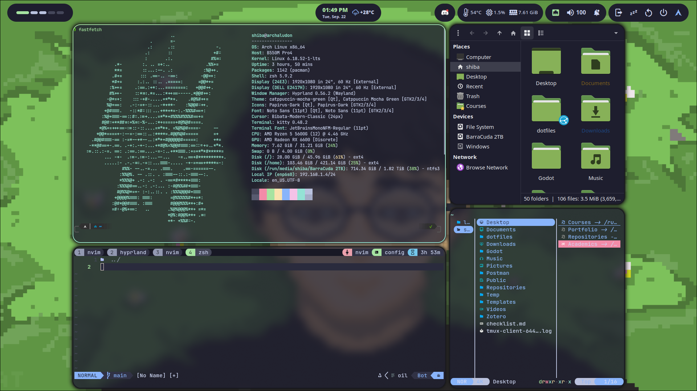

<div align="center">

# 🌿 dotfiles

**Arch Linux · Hyprland · Catppuccin Mocha**

My personal dotfiles for a Wayland-native desktop environment, managed with [GNU Stow](https://www.gnu.org/software/stow/).

</div>

---

## 📸 Preview



> Dual 1920×1080 setup — Waybar on top, Kitty + Neovim, Thunar floating, fastfetch in terminal.

---

## 🖥️ System Info

| Component       | Details                              |
| --------------- | ------------------------------------ |
| **OS**          | Arch Linux (x86_64)                  |
| **WM**          | [Hyprland](https://hyprland.org/) (Wayland) |
| **Session**     | [UWSM](https://github.com/Vladimir-csp/uwsm) |
| **CPU**         | AMD Ryzen 5 5600G                    |
| **GPU**         | AMD Radeon RX 6600                   |
| **Displays**    | 2× 1920×1080 (DP-1 @ 60Hz, DP-2 @ 165Hz) |
| **Shell**       | Zsh + Oh-My-Zsh + Powerlevel10k      |
| **Terminal**    | [Kitty](https://sw.kovidgoyal.net/kitty/) |
| **Login Manager** | SDDM + [Astronaut Theme](https://github.com/keyitdev/sddm-astronaut-theme) |

---

## 🎨 Theming

The entire setup uses the **Catppuccin Mocha** color palette for a consistent look across every component.

| Component         | Theme / Style                              |
| ----------------- | ------------------------------------------ |
| **Color Scheme**  | [Catppuccin Mocha](https://github.com/catppuccin/catppuccin) |
| **GTK Theme**     | `catppuccin-gtk-theme-mocha`               |
| **Qt Theme**      | Kvantum + `kvantum-theme-catppuccin-git`   |
| **Icon Theme**    | [Papirus-Dark](https://github.com/PapirusDevelopmentTeam/papirus-icon-theme) |
| **Cursor**        | [Bibata-Modern-Classic](https://github.com/ful1e5/Bibata_Cursor) |
| **Fonts**         | JetBrains Mono Nerd (terminal), Noto Sans (UI) |
| **Wallpaper**     | Set per-monitor via [Hyprpaper](https://github.com/hyprwm/hyprpaper) |

### Window Decoration
- **Rounding**: 20px corners with blurred backgrounds
- **Borders**: 2px, gradient from `green → teal` (Catppuccin) on active windows
- **Shadows**: Deep drop shadows for floating windows
- **Opacity**: Selective per-app transparency via window rules
- **Animations**: Tuned spring & bezier curves for fluid motion

---

## 🧩 Components

| Role                    | Tool                                                                   |
| ----------------------- | ---------------------------------------------------------------------- |
| **Window Manager**      | [Hyprland](https://hyprland.org/)                                      |
| **Bar**                 | [Waybar](https://github.com/Alexays/Waybar)                            |
| **App Launcher**        | [Rofi](https://github.com/davatorium/rofi)                             |
| **Notifications**       | [SwayNC](https://github.com/ErikReider/SwayNotificationCenter)         |
| **Wallpaper**           | [Hyprpaper](https://github.com/hyprwm/hyprpaper)                       |
| **Terminal**            | [Kitty](https://sw.kovidgoyal.net/kitty/)                              |
| **File Manager**        | [Thunar](https://docs.xfce.org/xfce/thunar/start) / [Yazi](https://yazi-rs.github.io/) (TUI) |
| **Editor**              | [Neovim](https://neovim.io/) (Lazy.nvim)                               |
| **Multiplexer**         | [Tmux](https://github.com/tmux/tmux)                                   |
| **Browser**             | [Brave](https://brave.com/)                                            |
| **Audio**               | PipeWire + WirePlumber + PulseAudio                                    |
| **Bluetooth**           | Blueman                                                                |
| **Clipboard**           | [cliphist](https://github.com/sentriz/cliphist) + wl-paste             |
| **Screenshots**         | [Grim](https://sr.ht/~emersion/grim/) + [Slurp](https://github.com/emersion/slurp) + [Swappy](https://github.com/jtheoof/swappy) |
| **Color Picker**        | [Hyprpicker](https://github.com/hyprwm/hyprpicker)                     |
| **Fetch**               | [Fastfetch](https://github.com/fastfetch-cli/fastfetch)                |

---

## ⚙️ Hyprland Configuration

The Hyprland config is written in **Lua** using the native Hyprland scripting API, split into clean modules under `hypr/.config/hypr/modules/`:

```
modules/
├── autostart.lua     # Startup daemons (Waybar, SwayNC, Hyprpaper, Blueman...)
├── colors.lua        # Catppuccin Mocha color definitions
├── decorations.lua   # Borders, blur, shadows, animations
├── env.lua           # Wayland environment variables
├── input.lua         # Keyboard & mouse settings
├── keybinds.lua      # All keybindings
├── layout.lua        # Scrolling layout (with dwindle/master fallbacks)
├── misc.lua          # Miscellaneous options
├── monitors.lua      # Dual-monitor configuration
└── windowrules.lua   # Per-app window rules & layer rules
```

### Layout

Uses the **Scrolling layout** as the default, with `fullscreen_on_one_column = true`. Dwindle and Master layouts are also configured as fallbacks.

### Multi-Monitor Workspaces

Uses the [split-monitor-workspaces](https://github.com/Duckonaut/split-monitor-workspaces) plugin — each monitor gets its own independent set of **5 persistent workspaces**, so `Super + 1` always refers to workspace 1 *on the focused monitor*.

---

## 📊 Waybar

The bar is split into three zones:

- **Left** — Hyprland workspace indicators (with Nerd Font icons)
- **Center** — Clock with inline calendar tooltip + live weather widget
- **Right** — System tray · Temperature · CPU · RAM · Network · Volume · SwayNC notification toggle · Power drawer (logout / sleep / reboot / shutdown)

---

## ⌨️ Keybindings

> `Super` = Windows key (`SUPER`)

| Keybind                    | Action                              |
| -------------------------- | ----------------------------------- |
| `Super + C`                | Open terminal (Kitty)               |
| `Super + E`                | Open file manager (Yazi in Kitty)   |
| `Super + Space`            | Open app launcher (Rofi)            |
| `Super + Q`                | Close active window                 |
| `Super + F`                | Toggle fullscreen                   |
| `Super + V`                | Toggle floating                     |
| `Super + N`                | Toggle notification center          |
| `Super + Z`                | Toggle scratchpad                   |
| `Super + M`                | Exit Hyprland (with confirmation)   |
| `Super + H/J/K/L`          | Move focus (Vim-style)              |
| `Super + 1–0`              | Switch workspace (per monitor)      |
| `Super + Shift + 1–0`      | Move window to workspace (silent)   |
| `Super + Shift + S`        | Screenshot selection → Swappy       |
| `Super + S`                | Fullscreen screenshot               |
| `Super + Shift + P`        | Screenshot to clipboard             |
| `Super + R`                | Reload Waybar                       |
| `Super + Mouse drag`       | Move window                         |
| `Super + Right-drag`       | Resize window                       |
| Media keys                 | Volume, brightness, playback        |

---

## 📝 Neovim

Configured with **[Lazy.nvim](https://github.com/folke/lazy.nvim)** and includes:

- **Theme**: Catppuccin Mocha (transparent background)
- **Completion**: [Blink.cmp](https://github.com/Saghen/blink.cmp)
- **LSP**: `nvim-lspconfig` + Mason
- **Treesitter**: Syntax highlighting
- **File navigation**: [Oil.nvim](https://github.com/stevearc/oil.nvim)
- **Fuzzy finding**: Telescope + [Snacks.nvim](https://github.com/folke/snacks.nvim)
- **Git**: Gitsigns + Lazygit integration
- **Statusline**: Lualine
- **Debugging**: DAP (nvim-dap)
- **Linting / Formatting**: nvim-lint + conform.nvim
- **Tmux navigation**: seamless `Ctrl+h/j/k/l` pane switching

---

## 🐚 Shell

- **Shell**: Zsh + [Oh-My-Zsh](https://ohmyz.sh/) + [Powerlevel10k](https://github.com/romkatv/powerlevel10k)
- **Plugins**: `git`, `zsh-autosuggestions`, `zsh-syntax-highlighting`, `you-should-use`, `archlinux`
- **Node Version Manager**: [fnm](https://github.com/Schniz/fnm) (auto-switching on `cd`)
- **`y` function**: Yazi wrapper that `cd`s into the last directory on exit

---

## 📁 Repository Structure

Dotfiles are managed with **GNU Stow**. Each directory maps to a program and is stowed from the repo root:

```
dotfiles/
├── fastfetch/    # Fastfetch system fetch config
├── fontconfig/   # Font rendering rules
├── gtk-3.0/      # GTK theming
├── hypr/         # Hyprland + Hyprpaper
├── kitty/        # Kitty terminal (Catppuccin Mocha)
├── nvim/         # Neovim (Lazy.nvim)
├── rofi/         # Rofi launcher
├── swaync/       # SwayNC notification center
├── tmux/         # Tmux config
├── waybar/       # Waybar status bar
├── yazi/         # Yazi file manager
└── zsh/          # Zshrc
```

### Installation

```bash
# Clone the repo
git clone https://github.com/Shibarashii/archaludon ~/dotfiles
cd ~/dotfiles

# Stow a specific config (e.g. hyprland)
stow hypr

# Or stow everything at once
stow */
```

> **Note**: Back up any existing config files before stowing to avoid conflicts.

---

<div align="center">

Made with 💚 on Arch Linux

</div>
