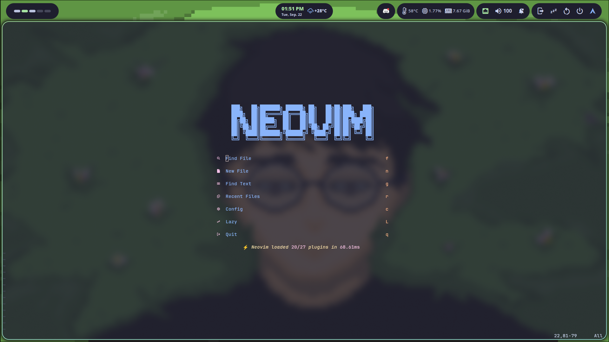
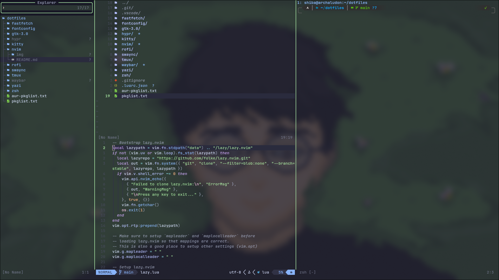

# Neovim

Neovim configuration using [Lazy.nvim](https://github.com/folke/lazy.nvim).

| | |
|---|---|
| **Dashboard** |  |
| **Full view** |  |

## Plugins

| Category | Plugin |
|---|---|
| **Theme** | Catppuccin Mocha (transparent bg) |
| **Completion** | blink.cmp |
| **LSP** | nvim-lspconfig + Mason |
| **Syntax** | Treesitter |
| **File nav** | Oil.nvim |
| **Fuzzy find** | Telescope + Snacks.nvim |
| **Git** | Gitsigns + Lazygit |
| **Statusline** | Lualine |
| **Debug** | nvim-dap |
| **Lint/Format** | nvim-lint + conform.nvim |
| **Tmux nav** | nvim-tmux-navigator |
| **AI** | opencode.nvim |
