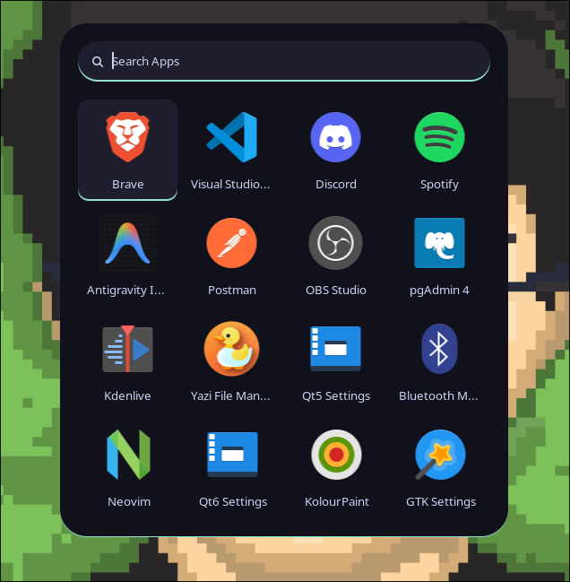

# Rofi

Application launcher configuration.

## Details

- Style: custom `type-3` launcher (`~/.config/rofi/type-3/launcher.sh`)
- Rounded dark panel with app icons
- Blur applied via Hyprland layer rule
- Triggered with `Super + Space`
