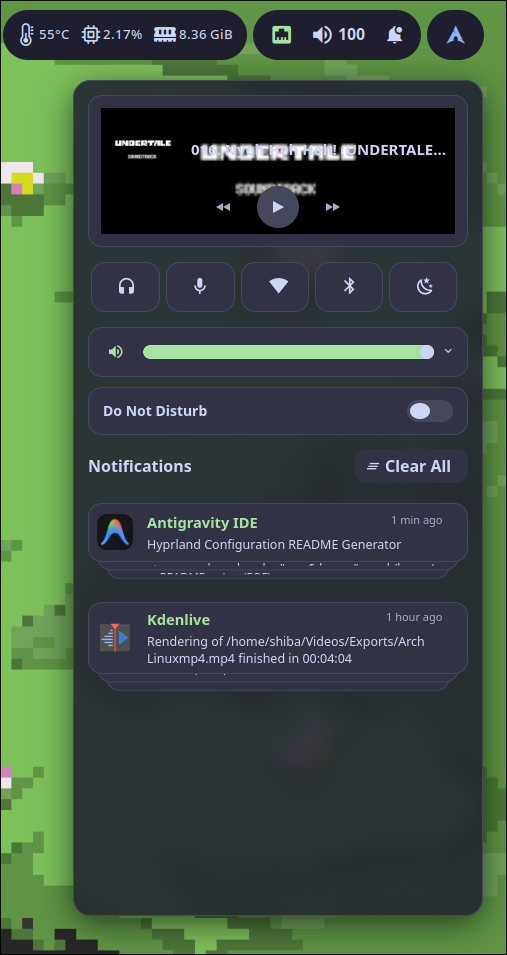

# SwayNC

Notification center and notification daemon configuration.

## Details

- Replaces dunst as the notification daemon
- Slide-in animation from top (via Hyprland layer rule)
- Blurred background on both the control center and notification popups
- Toggle with `Super + N`, dismiss DND with `Super + Shift + N`
- Waybar bell icon reflects notification / DND state
