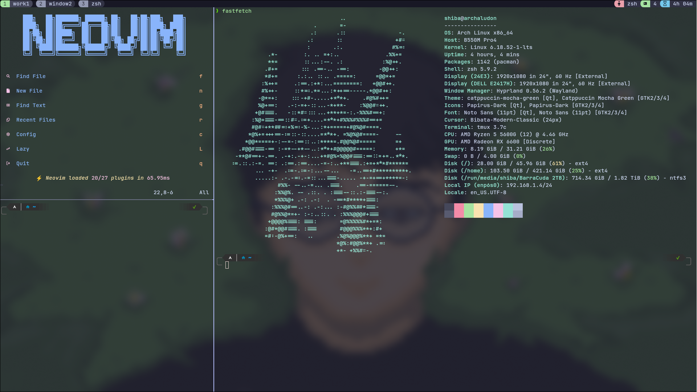

# Tmux

Terminal multiplexer configuration.

## Details

- Seamless pane navigation with Neovim via `nvim-tmux-navigator` (`Ctrl + h/j/k/l`)
- Status bar styled to match the Catppuccin Mocha theme
- Named windows shown in the top-left status line
